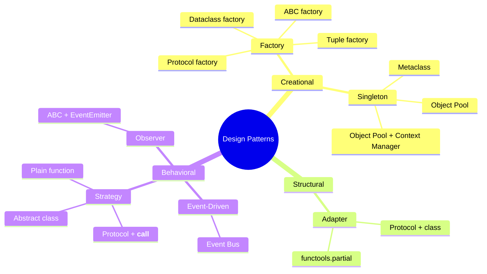

# Design Patterns in Python

A collection of common design patterns implemented in Python, exploring multiple approaches for each — from classic class-based solutions to more idiomatic Python using `Protocol`, `dataclass`, `functools.partial`, and metaclasses.

---

## Patterns

### Creational

| Pattern | Folder | Description |
|---------|--------|-------------|
| Factory / Abstract Factory | [`factory/`](./factory/) | Creates families of related objects without specifying concrete classes |
| Singleton & Object Pool | [`singleton/`](./singleton/) | Controls instance count — exactly one (Singleton) or a fixed pool (Object Pool) |

### Structural

| Pattern | Folder | Description |
|---------|--------|-------------|
| Adapter | [`adapter/`](./adapter/) | Bridges incompatible interfaces without modifying either side |

### Behavioral

| Pattern | Folder | Description |
|---------|--------|-------------|
| Strategy | [`strategy/`](./strategy/) | Encapsulates interchangeable algorithms and injects them at runtime |
| Observer | [`observer/`](./observer/) | Notifies multiple dependents automatically when a subject changes state |
| Event-Driven (Event Bus) | [`event_driven/`](./event_driven/) | Decouples publishers and subscribers through a central event broker |

---

## Folder structure

```
design pattern/
├── adapter/
│   ├── partial.py          # Adapter via functools.partial
│   └── protocol.py         # Adapter via Protocol + wrapper class
├── event_driven/
│   └── event.py            # Event Bus with pub/sub dispatch
├── factory/
│   ├── dataclass.py        # Factory using @dataclass
│   ├── factory.py          # Classic ABC factory
│   ├── protocol.py         # Factory using Protocol (structural typing)
│   └── tuple.py            # Factory as a tuple of classes
├── observer/
│   └── class.py            # Observer with ABC + EventEmitter
├── singleton/
│   ├── metaclass.py        # Singleton via custom metaclass
│   ├── object_pool.py      # Object Pool (basic)
│   └── object_pool_context.py  # Object Pool with context manager
└── strategy/
    ├── class.py            # Strategy via ABC
    ├── dunder.py           # Strategy via Protocol + __call__
    └── function_base.py    # Strategy as plain Callable
```

---

## Quick reference



---

## Approaches used across patterns

| Technique | Used in |
|-----------|---------|
| `ABC` + `abstractmethod` | Strategy, Observer, Factory |
| `Protocol` (structural typing) | Strategy, Factory, Adapter |
| `@dataclass` | Strategy (`function_base`), Factory |
| `metaclass` | Singleton |
| `functools.partial` | Adapter |
| Context manager (`__enter__`/`__exit__`) | Singleton (Object Pool) |
| Plain callables / functions | Strategy, Event-Driven |
