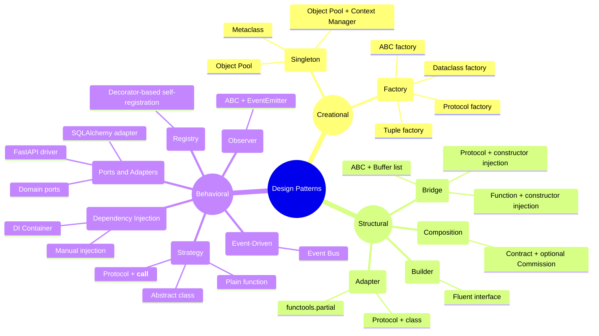

# Design Patterns in Python

A collection of common design patterns implemented in Python, exploring multiple approaches for each — from classic class-based solutions to more idiomatic Python using `Protocol`, `dataclass`, `functools.partial`, and metaclasses.

---

## Patterns

### Creational

| Pattern | Folder | Description |
|---------|--------|-------------|
| Factory / Abstract Factory | [`factory/`](./factory/) | Creates families of related objects without specifying concrete classes |
| Singleton & Object Pool | [`singleton/`](./singleton/) | Controls instance count — exactly one (Singleton) or a fixed pool (Object Pool) |

### Structural

| Pattern | Folder | Description |
|---------|--------|-------------|
| Adapter | [`adapter/`](./adapter/) | Bridges incompatible interfaces without modifying either side |
| Bridge | [`bridge/`](./bridge/) | Decouples abstraction from implementation so both can vary independently |
| Builder | [`builder/`](./builder/) | Constructs complex objects step by step via a fluent interface |
| Composition | [`composition/`](./composition/) | Builds complex behaviour by combining small objects instead of deep inheritance |

### Behavioral

| Pattern | Folder | Description |
|---------|--------|-------------|
| Strategy | [`strategy/`](./strategy/) | Encapsulates interchangeable algorithms and injects them at runtime |
| Observer | [`observer/`](./observer/) | Notifies multiple dependents automatically when a subject changes state |
| Event-Driven (Event Bus) | [`event_driven/`](./event_driven/) | Decouples publishers and subscribers through a central event broker |
| Registry | [`registory/`](./registory/) | Central map of named handlers; self-registration via decorators |
| Dependency Injection | [`dependency_injection/`](./dependency_injection/) | Passes collaborators from outside; decouples classes from concrete implementations |
| Ports & Adapters | [`port&adapter/`](./port&adapter/) | Isolates domain from infrastructure via ports (interfaces) and adapters (implementations) |

---

## Folder structure

```
design pattern/
├── adapter/
│   ├── partial.py          # Adapter via functools.partial
│   └── protocol.py         # Adapter via Protocol + wrapper class
├── bridge/
│   ├── abc.py              # Bridge via ABC — list of Buffer callables
│   ├── protocol.py         # Bridge via Protocol — device injected via constructor
│   └── function.py         # Bridge via plain callable — Buffer injected via constructor
├── builder/
│   └── class.py            # QueryBuilder with fluent interface
├── composition/
│   └── class.py            # Employee pay via Contract + optional Commission composition
├── dependency_injection/
│   ├── simple.py           # Manual DI — dependencies passed directly in main()
│   └── di_container.py     # DI Container with register/resolve + singleton support
├── event_driven/
│   └── event.py            # Event Bus with pub/sub dispatch
├── factory/
│   ├── dataclass.py        # Factory using @dataclass
│   ├── factory.py          # Classic ABC factory
│   ├── protocol.py         # Factory using Protocol (structural typing)
│   └── tuple.py            # Factory as a tuple of classes
├── observer/
│   └── class.py            # Observer with ABC + EventEmitter
├── singleton/
│   ├── metaclass.py        # Singleton via custom metaclass
│   ├── object_pool.py      # Object Pool (basic)
│   └── object_pool_context.py  # Object Pool with context manager
├── port&adapter/
│   ├── domain/
│   │   ├── models.py       # Frozen dataclasses — OrderRequest, OrderPlaced
│   │   ├── ports.py        # InventoryPort Protocol
│   │   ├── use_cases.py    # place_order() — pure business logic
│   │   └── errors.py       # DomainError hierarchy
│   ├── adapters.py         # SqlAlchemyInventoryAdapter
│   └── api.py              # FastAPI driver adapter
├── registory/
│   └── simple_registery.py # Decorator-based registry for named export handlers
└── strategy/
    ├── class.py            # Strategy via ABC
    ├── dunder.py           # Strategy via Protocol + __call__
    └── function_base.py    # Strategy as plain Callable
```

---

## Quick reference



---

## Approaches used across patterns

| Technique | Used in |
|-----------|---------|
| `ABC` + `abstractmethod` | Strategy, Observer, Factory, Bridge |
| `Protocol` (structural typing) | Strategy, Factory, Adapter, Bridge |
| `@dataclass` | Strategy (`function_base`), Factory, Bridge |
| `metaclass` | Singleton |
| `functools.partial` | Adapter |
| Context manager (`__enter__`/`__exit__`) | Singleton (Object Pool) |
| Plain callables / functions | Strategy, Event-Driven, Bridge, Registry |
| Decorator / `@wraps` | Registry |
