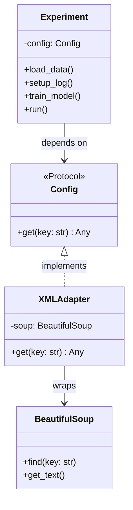
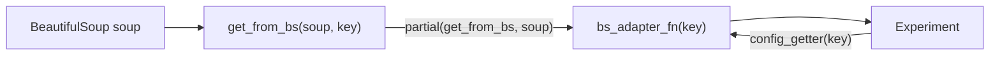

# Adapter Pattern

The **Adapter** pattern converts the interface of a class (or data source) into the interface a client expects. It acts as a bridge between two incompatible interfaces so they can work together without modifying either side.

The classic analogy: a power plug adapter lets a US device work in a European socket — neither the device nor the socket changes, only the adapter in between.

## Problem solved here

`Experiment` needs a config source that it can call `.get(key)` on. But the actual config is an XML file parsed by `BeautifulSoup`, which has no `.get(key)` method. The adapter translates `soup.find(key)` into the interface `Experiment` expects.

---

## Files in this folder

| File | Adapter mechanism | Notes |
|------|------------------|-------|
| `protocol.py` | Adapter class + `Protocol` | `XMLAdapter` wraps a `BeautifulSoup` object and exposes a `.get(key)` method; `Config` Protocol defines the expected interface |
| `partial.py` | `functools.partial` | No adapter class; `get_from_bs(soup, key)` is partially applied with the `soup` argument pre-filled, producing a plain callable `ConfigGetter` |

Both achieve the same goal — decoupling `Experiment` from the XML parsing library — using different levels of structure.

---

## Mermaid Diagrams

### Class-based approach (`protocol.py`)

### Partial function approach (`partial.py`)

---

## Protocol vs Partial — tradeoff comparison

| Aspect | `protocol.py` | `partial.py` |
|--------|--------------|-------------|
| Structure | Adapter class with explicit interface | Plain function + `partial` |
| Type safety | `Config` Protocol enforced by type checker | `ConfigGetter = Callable[[str], Any]` |
| Boilerplate | More — requires a wrapper class | Less — one function + one line |
| Extensibility | Easy to add multiple adaptees (e.g. JSON, YAML) | Natural for single-function adaptations |
| Readability | Intent is very explicit | Concise but requires understanding of `partial` |

Both approaches keep `Experiment` completely unaware of XML or BeautifulSoup — the core goal of the Adapter pattern.
