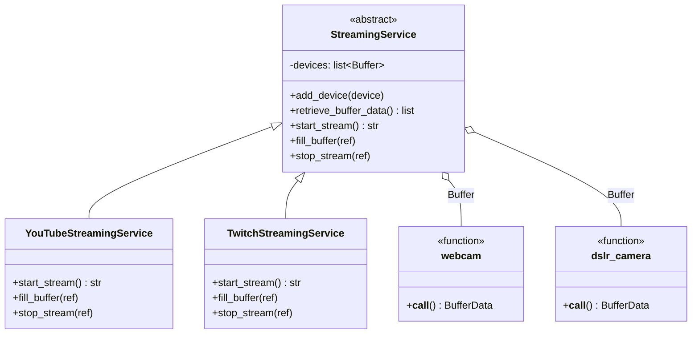
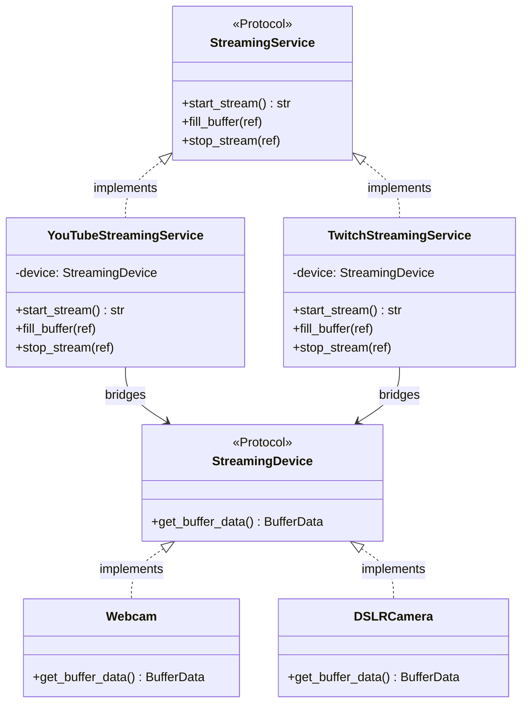
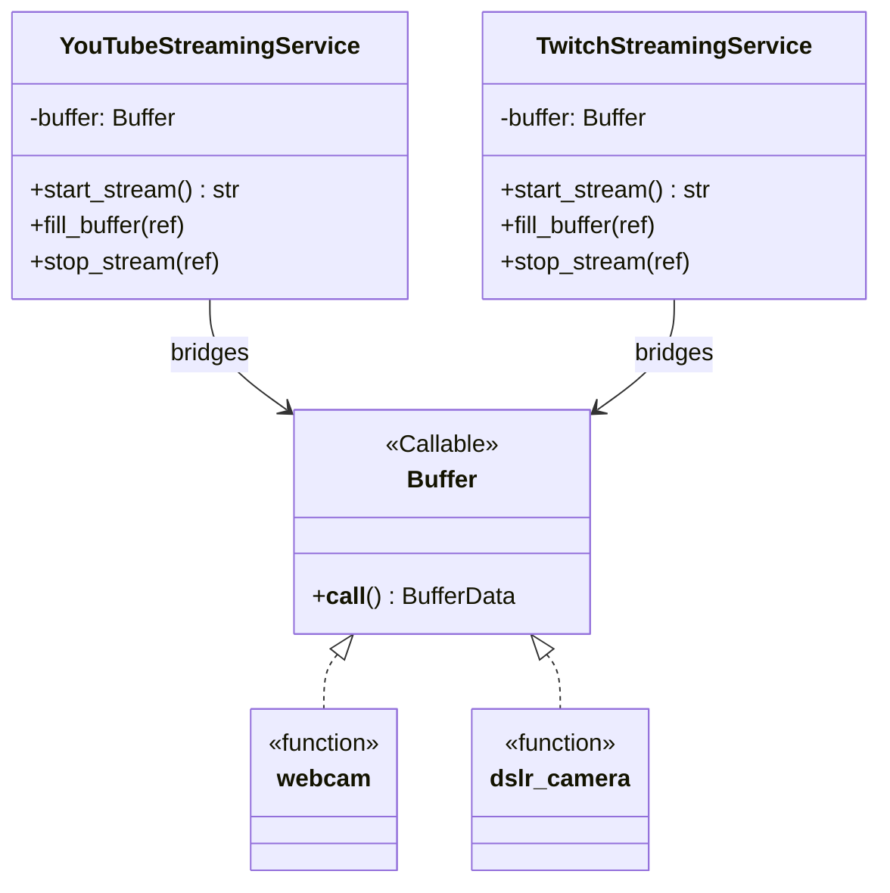
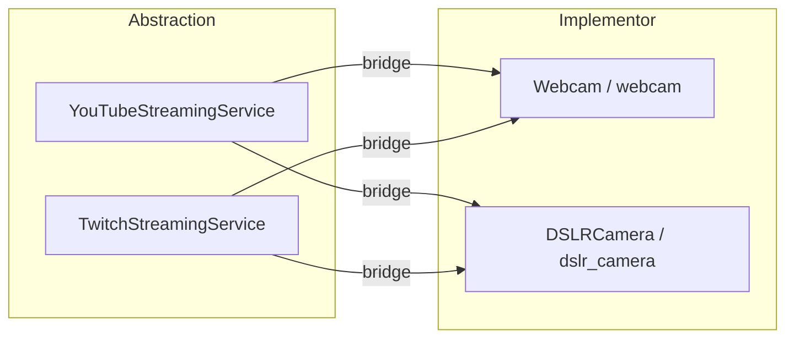

# Bridge Pattern

The **Bridge** pattern decouples an abstraction from its implementation so the two can vary independently. Instead of building one large inheritance tree that combines both dimensions, you compose them — the abstraction holds a reference to an implementor and delegates to it.

The result: adding a new device or a new streaming platform never requires touching the other side.

## Problem solved here

Two independent dimensions need to vary:

- **Abstraction** — *how* you stream (YouTube, Twitch)
- **Implementor** — *what* you capture from (Webcam, DSLR Camera)

Without Bridge you'd need classes like `YouTubeWebcamService`, `YouTubeDSLRService`, `TwitchWebcamService` … — combinations explode. Bridge keeps the two hierarchies separate and connects them through composition.

---

## Files in this folder

| File | Approach | Device type | Device coupling |
|------|----------|-------------|-----------------|
| `abc.py` | `ABC` + `abstractmethod` | Plain functions (`Buffer` callable) | List of callables on the service |
| `protocol.py` | `Protocol` (structural typing) | Classes with `get_buffer_data()` | Single device injected via constructor |
| `function.py` | Plain callables + `Protocol` service | Plain functions (`Buffer` callable) | Single callable injected via constructor |

---

## Mermaid Diagrams

### ABC approach (`abc.py`)

### Protocol approach (`protocol.py`)

### Function approach (`function.py`)

### Bridge concept — why it avoids combinatorial explosion

---

## Approach comparison

| Aspect | `abc.py` | `protocol.py` | `function.py` |
|--------|----------|--------------|--------------|
| Device type | Callable function | Class with method | Callable function |
| Multi-device support | Yes — `add_device()` list | No — single device | No — single callable |
| Service interface | ABC with `abstractmethod` | `Protocol` | `Protocol` |
| Type enforcement | Inheritance (hard) | Structural (duck typing) | Structural (duck typing) |
| Boilerplate | Medium | Low | Lowest |
| Best for | Multiple devices per stream | Clear named interfaces | Maximum simplicity |
