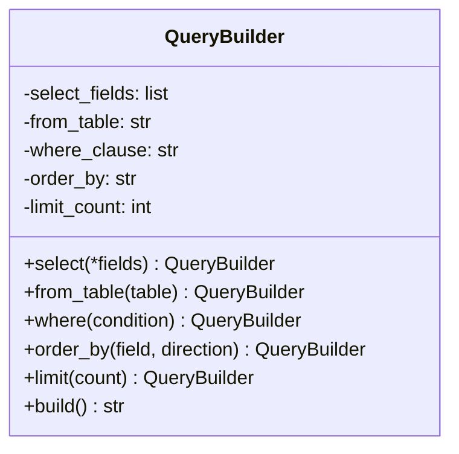
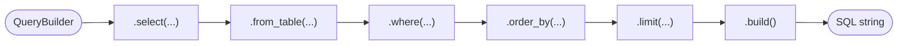
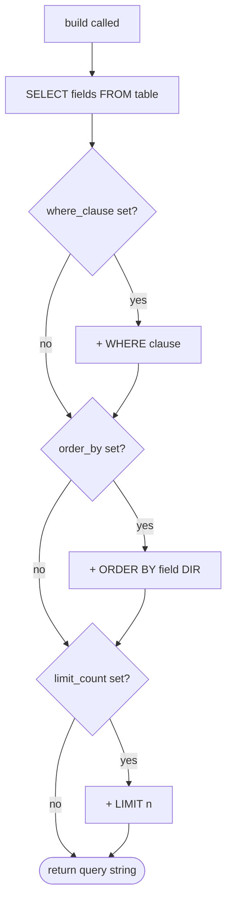

# Builder Pattern

The **Builder** pattern constructs a complex object step by step. It separates the construction process from the final representation, letting you build different configurations of an object using the same sequence of steps.

The defining Pythonic touch here is the **fluent interface** — each builder method returns `self`, so calls can be chained together in a readable, declarative style.

## When to use it

- An object has many optional parameters and constructors with long argument lists become unwieldy.
- You want to construct an object incrementally and only finalise it when ready.
- The same construction steps should be reusable to produce different representations.

## Implementation (`class.py`)

`QueryBuilder` assembles a SQL `SELECT` query piece by piece. Each method sets one part of the query and returns `self` to allow chaining. `build()` assembles all the parts into the final string.

```python
query = (QueryBuilder()
    .select("id", "name", "email")
    .from_table("users")
    .where("age > 18")
    .order_by("name")
    .limit(10)
    .build())
# SELECT id,name,email FROM users WHERE age > 18 ORDER BY name ASC LIMIT 10
```

| Method | Sets | Required |
|--------|------|----------|
| `.select(*fields)` | Columns to retrieve | Yes |
| `.from_table(table)` | Source table | Yes |
| `.where(condition)` | Filter condition | No |
| `.order_by(field, direction)` | Sort order | No |
| `.limit(count)` | Row limit | No |
| `.build()` | Assembles and returns the query string | — |

---

## Mermaid Diagrams

### Class structure



### Fluent interface chain



### Build logic



---

## Builder vs Factory

| Aspect | Builder | Factory |
|--------|---------|---------|
| Construction | Step-by-step, incremental | Single call |
| Optional parts | Natural — skip any step | Usually handled via overloads or kwargs |
| Output | One complex object | One of several related objects |
| Use case | SQL queries, HTTP requests, config objects | Codec pairs, exporters, loggers |
