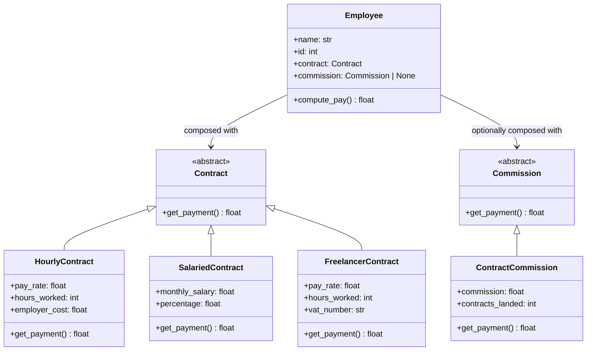
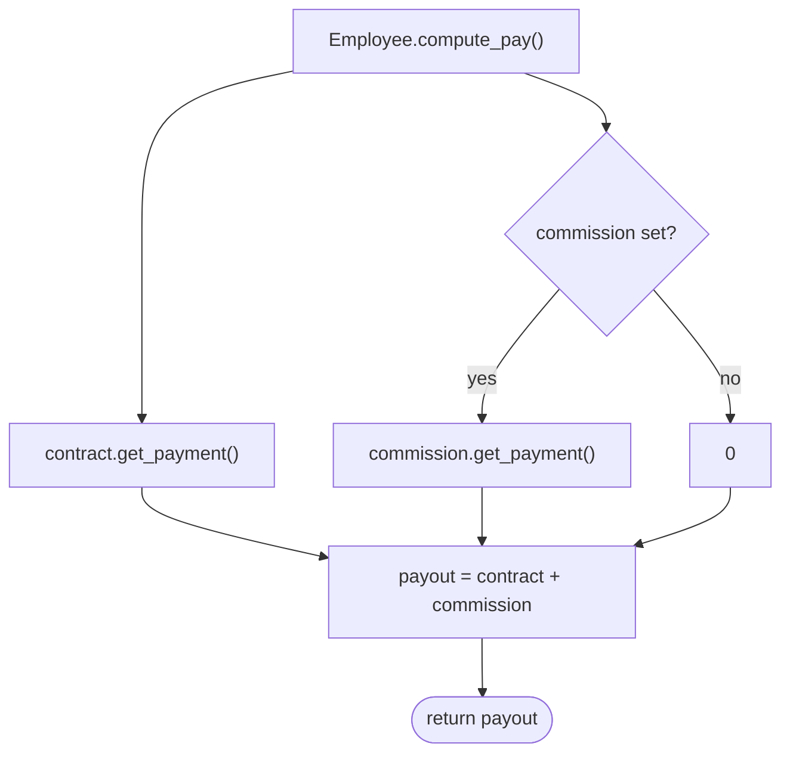
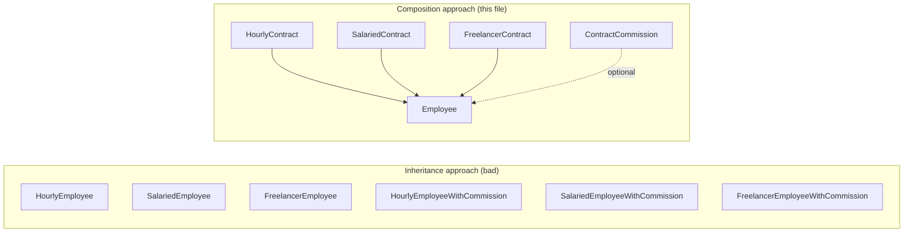

# Composition Pattern

**Composition over Inheritance** is the principle of building complex behaviour by combining small, focused objects rather than extending a deep class hierarchy. An object *has* collaborators (via attributes) instead of *is-a* variant of a base class.

The result is a flat, flexible design — you can mix and match behaviours at construction time without creating a new subclass for every combination.

## Problem solved here

An employee's pay depends on two independently varying dimensions:

- **Contract type** — hourly, salaried, or freelancer (how the base pay is calculated)
- **Commission** — optional, can be added to any contract type

The naive inheritance approach would need classes like `HourlySalariedWithCommission`, `FreelancerWithCommission`, etc. — combinations explode. Composition keeps both dimensions separate and combines them in `Employee` at construction time.

---

## Implementation (`class.py`)

| Class | Role |
|-------|------|
| `Contract` | ABC — defines `get_payment() -> float` for base pay |
| `HourlyContract` | Concrete contract — `pay_rate × hours_worked + employer_cost` |
| `SalariedContract` | Concrete contract — `monthly_salary × percentage` |
| `FreelancerContract` | Concrete contract — `pay_rate × hours_worked` |
| `Commission` | ABC — defines `get_payment() -> float` for bonus pay |
| `ContractCommission` | Concrete commission — `commission × contracts_landed` |
| `Employee` | Consumer — holds a `Contract` and an optional `Commission`; `compute_pay()` sums both |

```python
# Hourly employee, no commission
henry = Employee(name="Henry", id=12346, contract=HourlyContract(pay_rate=50, hours_worked=100))

# Salaried employee + commission — composed at construction time
sarah = Employee(
    name="Sarah",
    id=47832,
    contract=SalariedContract(monthly_salary=5000),
    commission=ContractCommission(contracts_landed=10),
)
```

---

## Mermaid Diagrams

### Class structure



### Pay computation flow



### Composition vs Inheritance — what it avoids



---

## Composition vs Inheritance

| Aspect | Inheritance | Composition |
|--------|-------------|-------------|
| Adding a new contract type | New subclass | New `Contract` implementation |
| Adding a new commission type | New subclass per contract | New `Commission` implementation |
| Combining behaviours | Combinatorial subclass explosion | Mix at construction time |
| Coupling | Tight — subclass depends on parent internals | Loose — only depends on the interface |
| Testability | Hard — must instantiate full hierarchy | Easy — test each piece independently |
