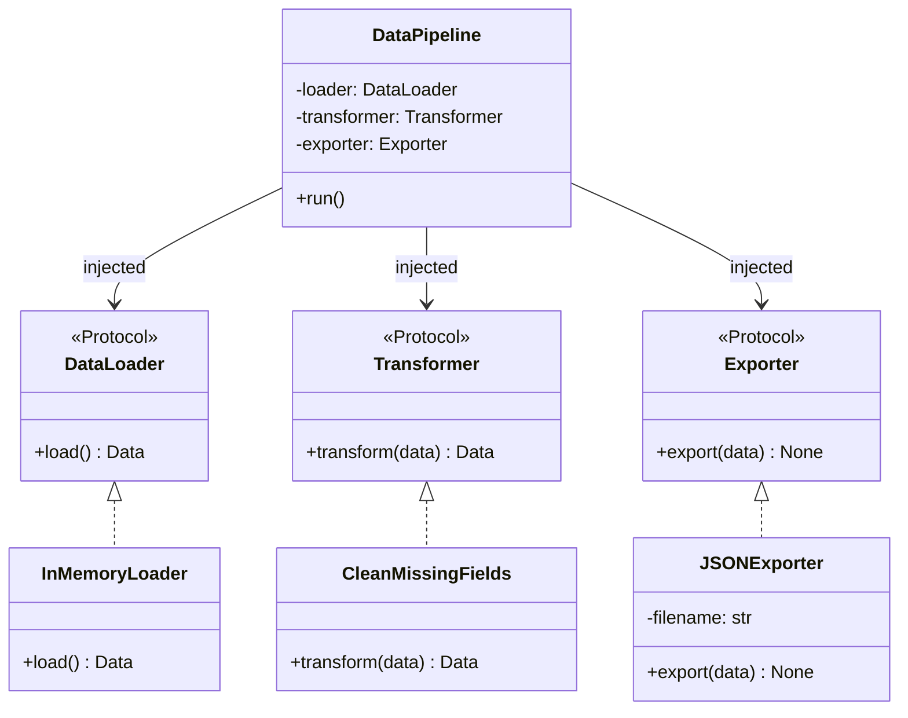
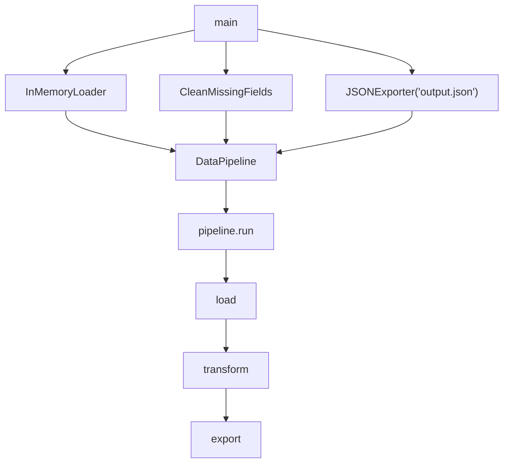
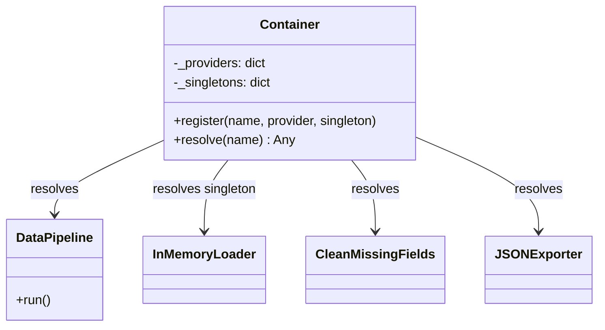
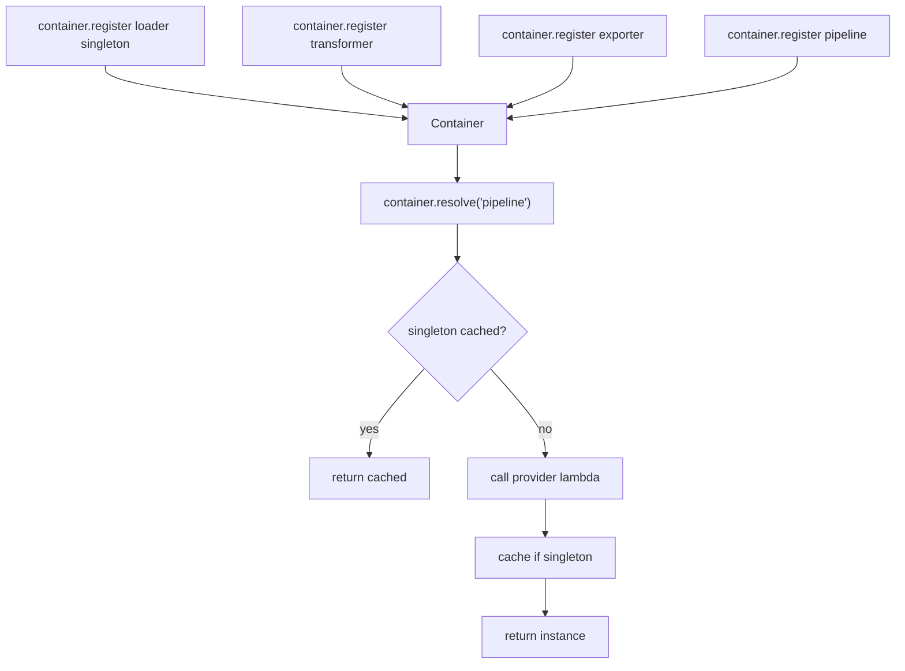

# Dependency Injection Pattern

**Dependency Injection (DI)** is the practice of passing an object's dependencies from the outside rather than constructing them internally. Instead of a class reaching out and creating its own collaborators, they are *injected* — via constructor, method, or a container — making the class decoupled from any specific implementation.

The core rule: depend on interfaces, not concrete classes.

## When to use it

- You want to swap implementations without touching the class that uses them (e.g. swap a real DB loader for an in-memory one in tests).
- A class has multiple collaborators that may change independently.
- You want to avoid hidden coupling from `import`-time instantiation inside a class.

---

## Files in this folder

| File | Approach | Notes |
|------|----------|-------|
| `simple.py` | Manual injection | Dependencies created in `main()` and passed into `DataPipeline` directly |
| `di_container.py` | DI Container | `Container` class manages registration, resolution, and singleton lifecycle |

Both files implement the same **data pipeline** — load → transform → export — but wire it up differently.

---

## Components

| Class / Protocol | Role |
|-----------------|------|
| `DataLoader` | Protocol — defines `load() -> Data` |
| `Transformer` | Protocol — defines `transform(data) -> Data` |
| `Exporter` | Protocol — defines `export(data) -> None` |
| `InMemoryLoader` | Concrete loader — returns hardcoded rows |
| `CleanMissingFields` | Concrete transformer — drops rows with `None` age |
| `JSONExporter` | Concrete exporter — writes data to a JSON file |
| `DataPipeline` | Consumer — receives all three dependencies via constructor |
| `Container` | DI container — registers providers and resolves instances by name |

---

## Mermaid Diagrams

### Class structure (both files)

### Manual injection (`simple.py`)

### DI Container (`di_container.py`)

---

## Simple vs Container — tradeoff comparison

| Aspect | `simple.py` | `di_container.py` |
|--------|-------------|-------------------|
| Wiring | Manual in `main()` | Registered in container, resolved by name |
| Singleton support | Manual (just reuse the variable) | Built-in `singleton=True` flag |
| Boilerplate | Minimal | Container setup required |
| Discoverability | Explicit — easy to follow | Indirection via string keys |
| Testability | Easy — swap in `main()` | Easy — swap the registered provider |
| Best for | Small pipelines, scripts | Larger apps with many shared dependencies |
