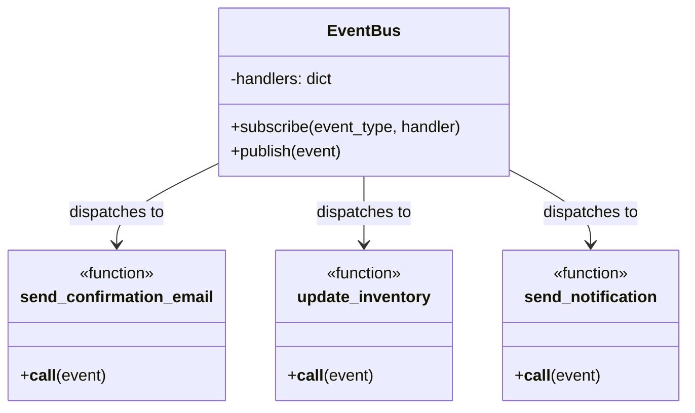
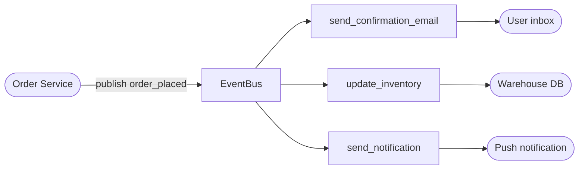
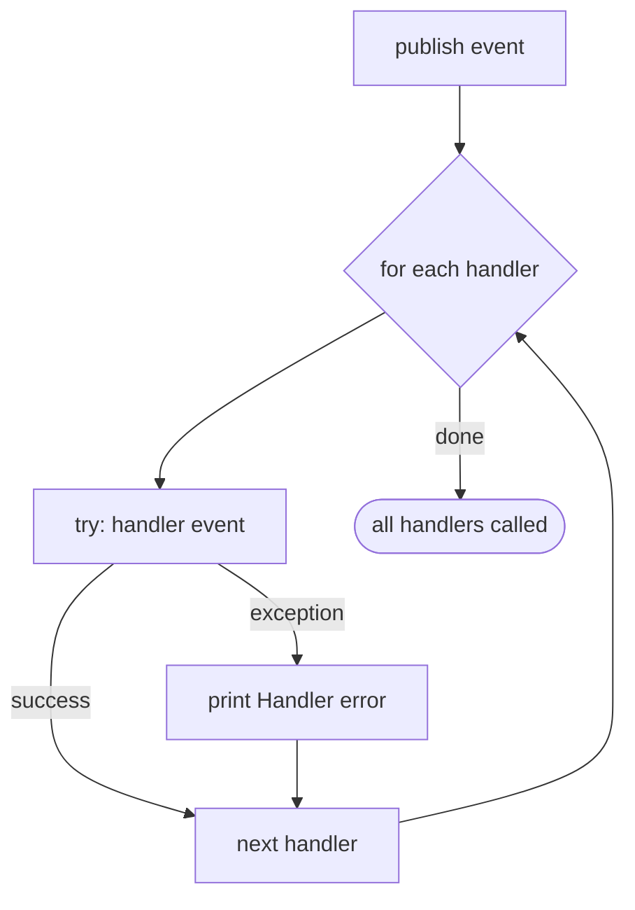

# Event-Driven Pattern (Event Bus)

The **Event-Driven** pattern decouples producers and consumers of events through a central **Event Bus**. Publishers fire events without knowing who will handle them; subscribers register handlers for specific event types without knowing who fires them.

This is a pub/sub variant of the Observer pattern where the intermediary (the bus) eliminates the direct reference between emitter and handler.

## When to use it

- You need many independent services to react to the same event without coupling them together.
- You want to add new handlers without modifying the event source.
- You are building event-sourced systems, microservices, or async workflows.

## Implementation (`event.py`)

| Component | Role |
|-----------|------|
| `EventBus` | Central broker — stores handlers keyed by event type; dispatches events to all matching handlers |
| `send_confirmation_email` | Handler — triggered on `order_placed` |
| `update_inventory` | Handler — triggered on `order_placed` |
| `send_notification` | Handler — triggered on `order_placed` |

Events are plain dicts with a `"type"` key. The bus looks up all handlers registered for that type and calls each one. Errors in one handler are caught so they don't block others.

```python
event_bus.subscribe("order_placed", send_confirmation_email)
event_bus.subscribe("order_placed", update_inventory)
event_bus.subscribe("order_placed", send_notification)

event_bus.publish({"type": "order_placed", "order_id": 12345, ...})
```

---

## Mermaid Diagrams

### Component structure



### Event lifecycle



### Error isolation



---

## Key properties of this implementation

- **Decoupled** — publishers and subscribers never reference each other directly.
- **Multi-handler** — multiple handlers can respond to a single event type.
- **Error-isolated** — a failing handler does not prevent others from running.
- **Synchronous** — handlers run sequentially in the same thread (async variant would use `asyncio` or a message broker like Redis/Kafka).
