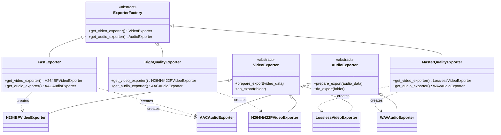
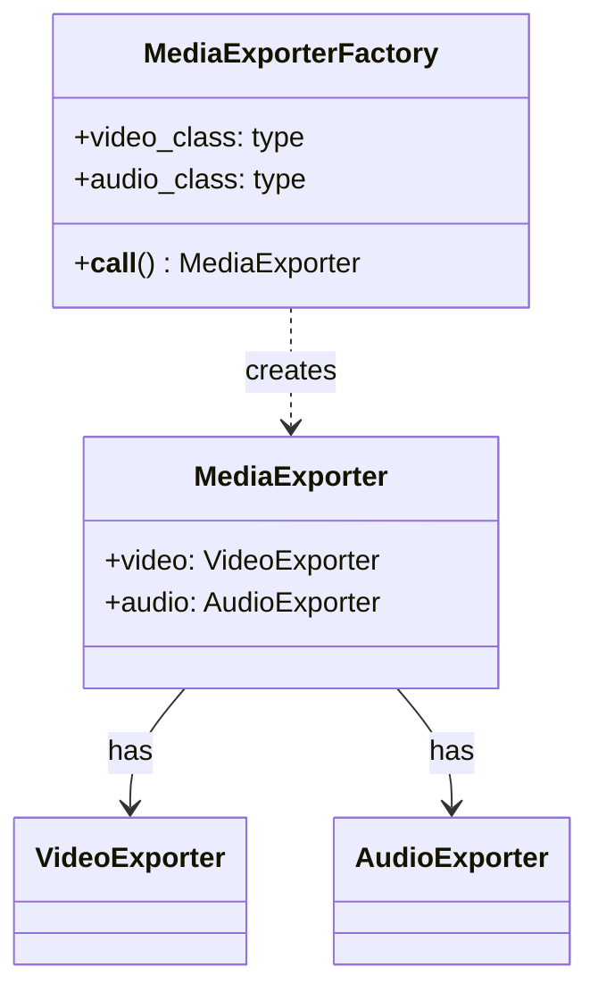

# Factory / Abstract Factory Pattern

The **Abstract Factory** pattern provides an interface for creating *families* of related objects without specifying their concrete classes. A factory encapsulates the "which class to instantiate" decision and keeps the client code decoupled from concrete implementations.

## Core concept

Instead of calling `H264BPVideoExporter()` and `AACAudioExporter()` directly, the client asks a factory for a `VideoExporter` and an `AudioExporter`. Swapping the factory swaps the entire family of objects in one place.

## Files in this folder

| File | Factory mechanism | Notes |
|------|------------------|-------|
| `factory.py` | ABC + concrete factory classes | Classic GoF approach; `ExporterFactory` ABC with `FastExporter`, `HighQualityExporter`, `MasterQualityExporter` |
| `protocol.py` | `Protocol` (structural typing) | Same factories but no inheritance; relies on duck typing |
| `tuple.py` | Tuple of classes | Factory is a `(VideoClass, AudioClass)` tuple; no factory object needed |
| `dataclass.py` | `@dataclass` factory | `MediaExporterFactory` dataclass holds class references and is callable via `__call__` |

All four produce the same result — a paired `VideoExporter` + `AudioExporter` — but differ in how much structure they impose.

---

## Mermaid Diagrams

### Abstract class approach (`factory.py`)

### Dataclass approach (`dataclass.py`)

---

## Quality presets

| Quality | Video codec | Audio codec |
|---------|------------|------------|
| `low` | H.264 Baseline | AAC |
| `high` | H.264 Hi422P | AAC |
| `master` | Lossless | WAV |
