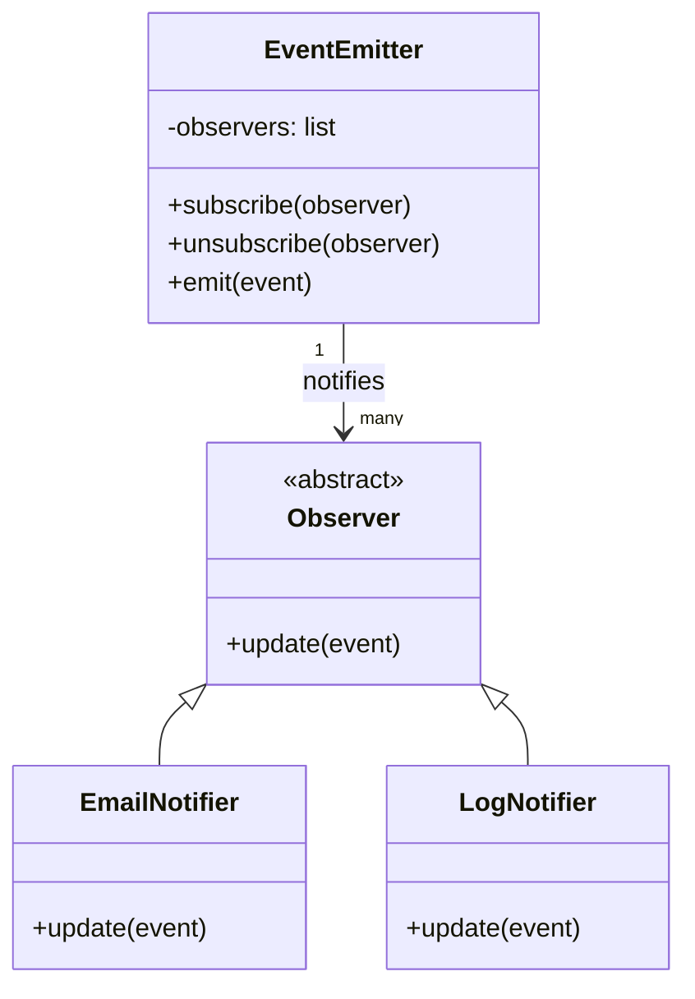
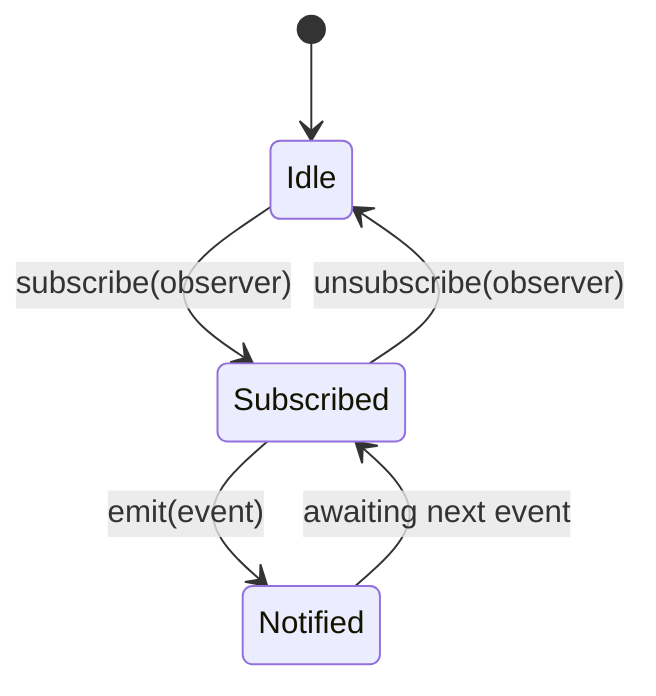

# Observer Pattern

The **Observer** pattern defines a one-to-many dependency between objects. When one object (the *subject* / *emitter*) changes state, all its registered *observers* are notified and updated automatically.

It decouples the producer of events from the consumers, so you can add or remove observers at runtime without touching the subject.

## When to use it

- You need to notify multiple objects when another object changes, without knowing who those objects are.
- You want to implement distributed event handling (pub/sub style).
- You want loose coupling between components.

## Implementation (`class.py`)

| Class | Role |
|-------|------|
| `Observer` | Abstract base — defines the `update(event)` interface |
| `EventEmitter` | Subject — holds a list of observers; calls `update` on all of them when `emit` is called |
| `EmailNotifier` | Concrete observer — sends an email notification |
| `LogNotifier` | Concrete observer — logs the event |

```python
emitter = EventEmitter()
emitter.subscribe(EmailNotifier())
emitter.subscribe(LogNotifier())
emitter.emit("User registered")
```

---

## Mermaid Diagrams

### Class structure



### Subscribe / Unsubscribe lifecycle



---

## Observer vs Event-Driven

| Aspect | Observer (`observer/`) | Event-Driven (`event_driven/`) |
|--------|----------------------|-------------------------------|
| Coupling | Observers hold a reference to emitter | Handlers only know the event type string |
| Dispatch | All observers get every event | Handlers are registered per event type |
| Type safety | Strong (ABC) | Weak (dict-based event payload) |
| Use case | Direct object relationships | Loosely coupled microservices / bus |
