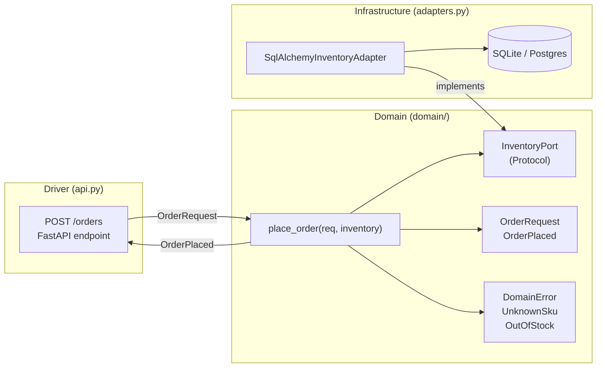
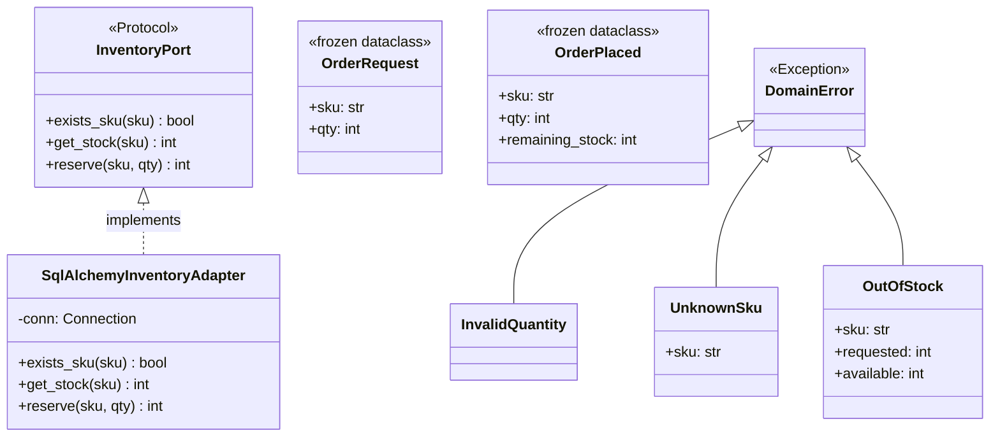
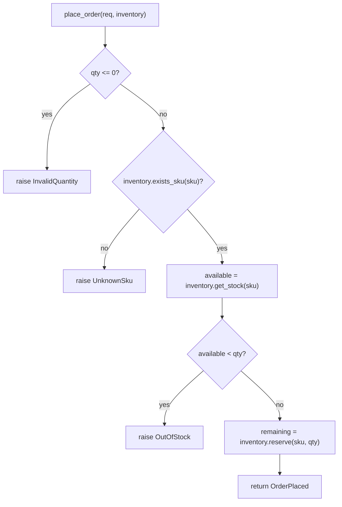
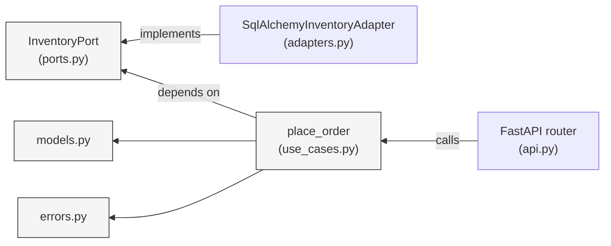

# Ports & Adapters Pattern (Hexagonal Architecture)

The **Ports & Adapters** pattern (also called *Hexagonal Architecture*) isolates the core business logic from all external concerns — databases, HTTP frameworks, message queues, etc. The domain sits at the centre and never imports anything from the outside world. Everything external connects through a **port** (an interface the domain defines) and an **adapter** (a concrete implementation of that port).

```
  [ FastAPI ]  ──►  [ Use Case ]  ──►  [ Port ]  ◄──  [ SQLAlchemy Adapter ]
    (driver)          (domain)        (interface)         (driven adapter)
```

## Core rule

The domain (`domain/`) has **zero** infrastructure imports. It defines what it needs via `Protocol` (ports), and the outside world fulfills those protocols via adapters. Dependencies always point **inward**.

---

## Files in this folder

```
port&adapter/
├── domain/
│   ├── models.py       # Pure data — OrderRequest, OrderPlaced (frozen dataclasses)
│   ├── ports.py        # InventoryPort Protocol — what the domain needs from the outside
│   ├── use_cases.py    # place_order() — all business logic lives here
│   └── errors.py       # DomainError, InvalidQuantity, UnknownSku, OutOfStock
├── adapters.py         # SqlAlchemyInventoryAdapter — implements InventoryPort over SQLAlchemy
└── api.py              # FastAPI router — HTTP driver adapter; wires payload → use case → response
```

| File | Layer | Role |
|------|-------|------|
| `domain/models.py` | Domain | Immutable value objects — no logic, no imports |
| `domain/ports.py` | Domain | `InventoryPort` Protocol — the contract the domain expects |
| `domain/use_cases.py` | Domain | `place_order()` — validates, checks stock, reserves |
| `domain/errors.py` | Domain | Typed domain exceptions |
| `adapters.py` | Infrastructure | `SqlAlchemyInventoryAdapter` — fulfills `InventoryPort` via SQL |
| `api.py` | Driver | FastAPI endpoint — translates HTTP ↔ domain objects |

---

## Mermaid Diagrams

### Layer architecture



### Class structure



### `place_order` business logic



### Dependency direction



---

## Key properties

- **Domain purity** — `domain/` has no imports from FastAPI, SQLAlchemy, or any infrastructure library.
- **Testability** — `place_order()` can be tested by passing any object that satisfies `InventoryPort` (e.g. an in-memory dict). No database needed.
- **Swappability** — swap `SqlAlchemyInventoryAdapter` for a Redis adapter, a mock, or a CSV reader without touching the domain.
- **Error typing** — domain errors (`UnknownSku`, `OutOfStock`) are caught at the HTTP boundary and mapped to appropriate HTTP status codes (404, 409).

---

## Ports & Adapters vs plain Dependency Injection

| Aspect | DI (dependency_injection/) | Ports & Adapters |
|--------|---------------------------|-----------------|
| Scope | Class-level wiring | Entire architecture |
| Domain isolation | Partial | Complete — no infra in domain |
| Port definition | Informal (Protocol or ABC) | Explicit — domain owns the interface |
| Driver adapters | Not distinguished | First-class concept (API layer) |
| Best for | Wiring object graphs | Production services and APIs |
