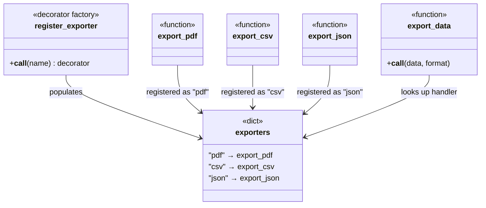
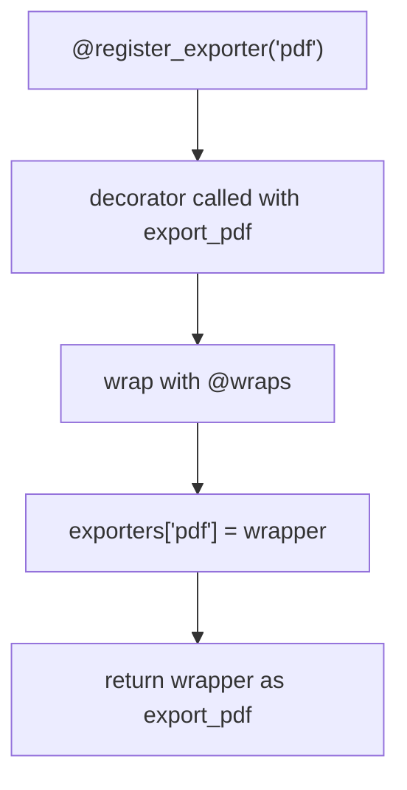
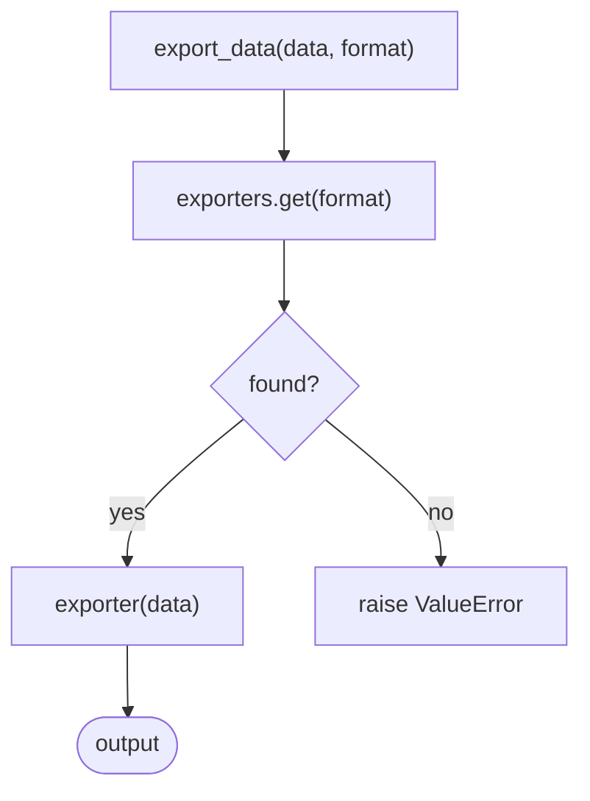

# Registry Pattern

The **Registry** pattern maintains a central map of named objects or functions, allowing components to be looked up and invoked by name at runtime. It decouples the caller from concrete implementations — the caller only needs to know a string key, not the actual class or function.

This implementation uses a **decorator-based registry**, where functions self-register at definition time using `@register_exporter("name")`. No manual wiring needed — decorating a function is enough to make it discoverable.

## When to use it

- You want to select behaviour at runtime based on a string key (e.g. user input, config, file extension).
- You want to add new handlers without modifying the dispatch logic.
- You want to avoid large `if/elif` chains mapping names to functions.

---

## Implementation (`simple_registery.py`)

| Component | Role |
|-----------|------|
| `exporters` | The registry — a `dict[str, ExportFn]` mapping format names to callables |
| `register_exporter(name)` | Decorator factory — wraps the function and stores it in `exporters` under `name` |
| `export_pdf` / `export_csv` / `export_json` | Registered handlers — each decorated with `@register_exporter(...)` |
| `export_data(data, format)` | Dispatcher — looks up the handler by format name and calls it |

Registration happens at **import time** via the decorator, so `exporters` is fully populated before `main()` runs.

```python
@register_exporter("pdf")
def export_pdf(data: Data) -> None:
    print(f"Exporting data to PDF: {data}")

# Later, dispatch by name:
export_data({"name": "Alice"}, "pdf")
```

---

## Mermaid Diagrams

### Structure



### Registration flow (at import time)



### Dispatch flow (at runtime)



---

## Registry vs Factory vs Strategy

| Aspect | Registry | Factory | Strategy |
|--------|----------|---------|----------|
| Lookup key | String name | Usually an enum/input | N/A — injected directly |
| Registration | Self-registering via decorator | Hard-coded in factory | Passed by caller |
| Adding a new variant | Add a decorated function | Add a new factory subclass | Add a new callable |
| Runtime selection | Yes — by string key | Yes — by user input | Yes — by caller choice |
| Dispatch mechanism | Dict lookup | Conditional / factory method | Composition |
