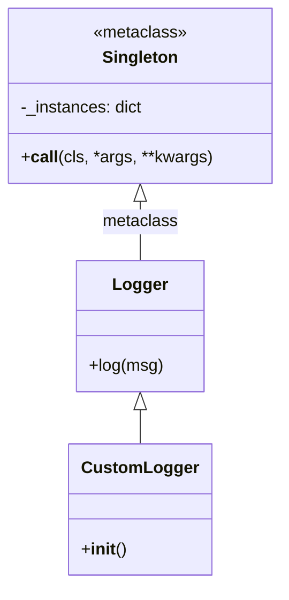
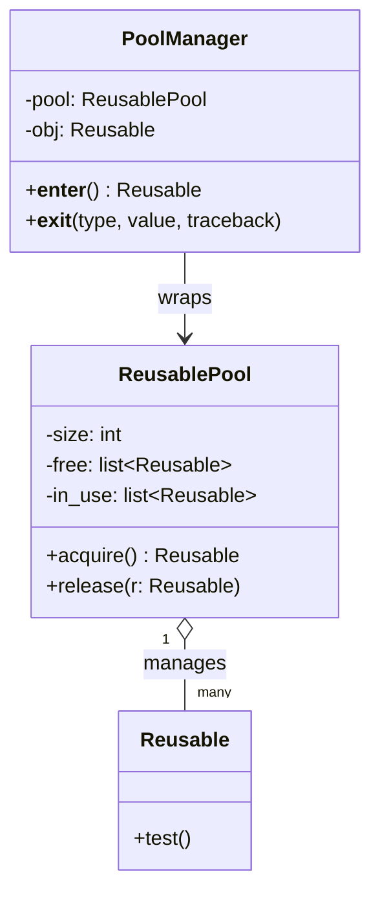

# Singleton & Object Pool Patterns

This folder contains two related creational patterns that control how and how many instances of a class exist.

---

## Singleton

The **Singleton** pattern ensures a class has **only one instance** and provides a global access point to it. It is useful for shared resources like loggers, config managers, or database connections where multiple instances would cause inconsistency.

### Implementation — Metaclass (`metaclass.py`)

The cleanest Pythonic approach: `Singleton` is a custom metaclass that overrides `__call__`. The first time a class is instantiated the instance is cached in `_instances`; every subsequent call returns the cached object.

```python
class Singleton(type):
    _instances: ClassVar[dict] = {}
    def __call__(cls, *args, **kwargs):
        if cls not in cls._instances:
            cls._instances[cls] = super().__call__(*args, **kwargs)
        return cls._instances[cls]
```

`Logger` and `CustomLogger` both use this metaclass, so `CustomLogger()` always returns the same object.



---

## Object Pool

The **Object Pool** pattern pre-allocates a fixed set of reusable objects and hands them out on demand. Rather than creating and destroying expensive objects repeatedly, clients *acquire* one from the pool and *release* it when done.

### Implementation — Basic pool (`object_pool.py`)

`ReusablePool` maintains two lists: `free` and `in_use`. `acquire()` moves an object from `free` → `in_use`; `release()` moves it back.

### Implementation — Context manager (`object_pool_context.py`)

`PoolManager` wraps the pool in a context manager (`__enter__` / `__exit__`), guaranteeing the object is always released even if an exception occurs.



---

## Comparison

| Concern | Singleton | Object Pool |
|---------|-----------|-------------|
| Number of instances | Exactly 1 | Fixed N |
| Use case | Shared global state | Expensive reusable resources |
| Thread safety | Needs locking | Needs locking |
| Python idiom | Metaclass | Context manager |
