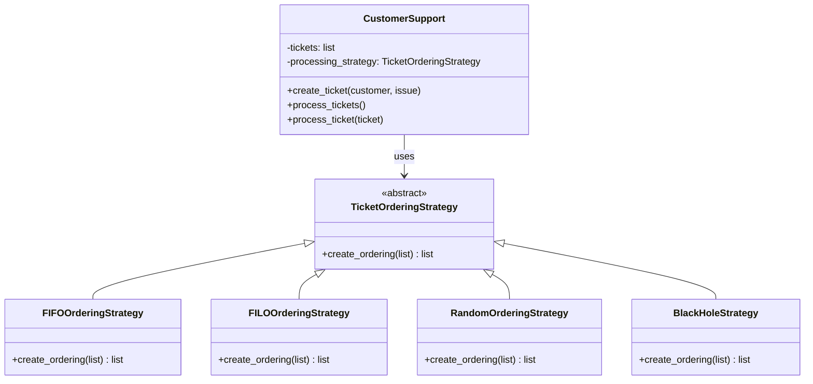
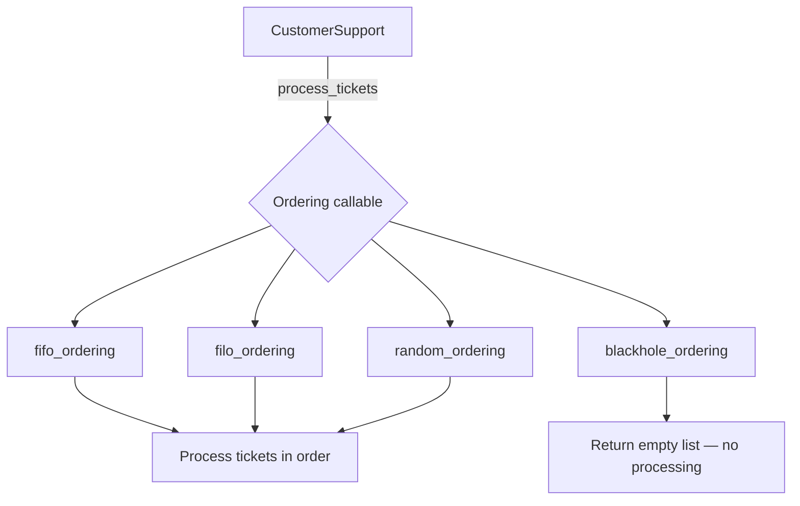
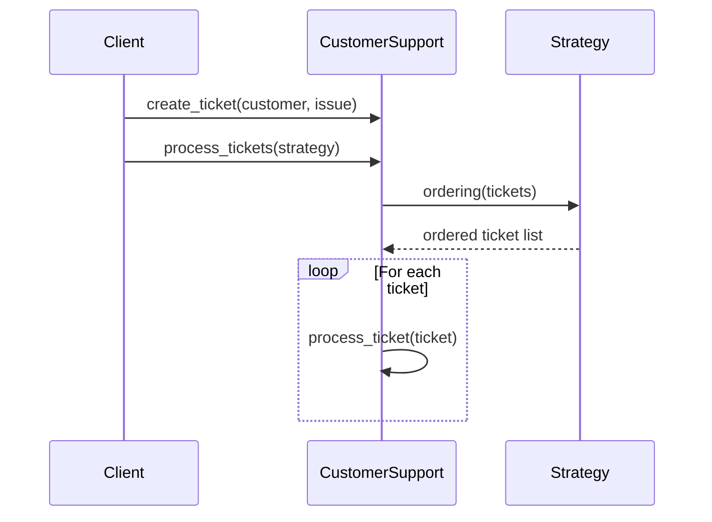

# Strategy Pattern

The **Strategy** pattern defines a family of algorithms, encapsulates each one, and makes them interchangeable. It lets the algorithm vary independently from the clients that use it.

The key idea is to extract the varying behaviour into a separate object (the *strategy*) and inject it into the context at runtime. This removes hard-coded conditionals and makes adding new behaviours as simple as creating a new class or function.

## When to use it

- You have multiple variants of an algorithm and want to switch between them at runtime.
- You want to avoid large `if/elif` chains that select behaviour.
- You need to isolate business logic from implementation details.

## Files in this folder

| File | Approach | Notes |
|------|----------|-------|
| `class.py` | Abstract base class | `TicketOrderingStrategy` ABC; strategy injected in constructor |
| `dunder.py` | Protocol + `__call__` | Callable objects satisfy a `Protocol`; strategy passed to `process_tickets` |
| `function_base.py` | Plain functions | Strategy is just a `Callable`; most lightweight approach |

All three examples model a **customer support ticket system** where tickets can be processed in FIFO, FILO, random, or blackhole order.

---

## Mermaid Diagram

### Class-based approach (`class.py`)

### Function-based approach (`function_base.py`)

### Runtime flow

